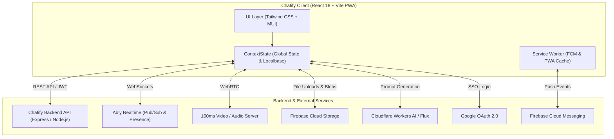

# 💬 Chatify — Modern Real-Time Chat & Video Platform (Frontend)

[](https://reactjs.org/)
[](https://vitejs.dev/)
[](https://tailwindcss.com/)
[](https://firebase.google.com/)
[](https://ably.com/)
[](https://100ms.live/)
[](https://web.dev/progressive-web-apps/)
[](LICENSE.txt)

> The official frontend client for **Chatify** — a progressive web application delivering real-time messaging, high-definition video/audio calling, rich media sharing, offline caching, and built-in AI chat & image generation.

🔗 **Backend Repository**: [Dhruv1704/chatify-backend](https://github.com/Dhruv1704/chatify-backend)

---

## 🌟 Table of Contents

- [Features](#-features)
- [Tech Stack](#-tech-stack)
- [Architecture & Workflow](#-architecture--workflow)
- [Project Structure](#-project-structure)
- [Prerequisites](#-prerequisites)
- [Environment Configuration](#-environment-configuration)
- [Installation & Getting Started](#-installation--getting-started)
- [Available Scripts](#-available-scripts)
- [Progressive Web App (PWA) & Offline Mode](#-progressive-web-app-pwa--offline-mode)
- [Deployment](#-deployment)
- [Contributing](#-contributing)
- [License](#-license)

---

## ✨ Features

### ⚡ Real-Time Messaging & Presence
- **Sub-millisecond Messaging**: Instant 1-on-1 direct messaging powered by **Ably Realtime**.
- **Live User Presence**: Real-time tracking of contacts' active online and offline status.
- **Typing Indicators**: Visual dynamic `...typing` status alerts during active input.
- **Unread Message Tracking**: Instant unread counts badge synced locally and over the cloud.
- **Message Management**: Select single or multiple messages (via long-press on mobile or click) to delete conversations seamlessly.

### 📁 Rich Media & File Sharing
- **Multi-Format Attachments**: Send photos, videos, audio clips, and documents.
- **Firebase Cloud Storage**: Resumable, direct file uploads with animated percentage progress indicators.
- **In-App Media Viewers**:
  - **Photos**: Fullscreen lightbox preview with zoom and pan powered by `react-photo-view`.
  - **Documents**: Embedded PDF and document viewer powered by `@cyntler/react-doc-viewer`.
- **Offline Blob Caching**: Downloaded media files are persisted locally for quick subsequent loading without re-fetching.

### 📞 HD Video & Voice Calling
- **Powered by 100ms RoomKit**: Crystal clear WebRTC 1-on-1 video and audio calling.
- **Interactive Call Controls**: Screen sharing, camera toggle, microphone mute/unmute, and custom device management.
- **Room Code Joining**: Seamless call invitations and connection via unique room codes.
- **Call History & Logs**: Complete incoming/outgoing call logs saved in local storage and synced to the database.

### 🤖 Built-In AI Assistant
- **AI Conversational Chat**: Conversational AI assistant supporting continuous context memory and markdown-formatted code & responses (`markdown-to-jsx`).
- **AI Text-to-Image Generation**: Generate high-fidelity images directly from prompts powered by Cloudflare Workers AI / Flux Schnell API.
- **Dedicated AI Bubbles**: Distinct chat bubbles with copy, view, and history management options.

### 📱 Offline-First Architecture
- **IndexedDB via Localbase**: Local database caching of user profile, contact lists, conversation threads, call logs, and downloaded attachments.
- **Network Resilience**: Full offline message browsing with automatic connection detection (`navigator.onLine`) and instant toast feedback.

### 🔔 Push Notifications
- **Firebase Cloud Messaging (FCM)**: Background push notifications for incoming messages and call alerts.
- **Service Worker Integration**: Managed by `firebase-messaging-sw.js` for background delivery even when the application tab is closed.
- **Dynamic Topic Subscription**: Real-time topic subscription and token renewal with backend synchronization.

### 🎨 Themes & Modern UX
- **Multi-Theme Support**: 4 vibrant themes (Light: *Sky Blue*, *Indigo*; Dark: *Slate Dark*, *Zinc Dark*).
- **Responsive & Mobile-First**: Adaptive drawer menus, mobile-optimized navigation, and hardware back-button handling via popstate listeners.
- **Rich Interactive Components**: Emojis (`emoji-picker-react`), auto-resizing text boxes (`react-textarea-autosize`), animated avatars (`react-avatar`), and sleek toast alerts (`react-toastify`).

---

## 🛠 Tech Stack

| Category | Technology |
|---|---|
| **Core Framework** | [React 18](https://react.dev/) with [Vite](https://vitejs.dev/) (SWC Fast Refresh) |
| **Styling & Icons** | [Tailwind CSS](https://tailwindcss.com/), [PostCSS](https://postcss.org/), [Material UI Icons](https://mui.com/) |
| **Realtime Messaging** | [Ably Realtime](https://ably.com/) (WebSockets Pub/Sub) |
| **Video & Audio Calls** | [100ms RoomKit](https://www.100ms.live/) (`@100mslive/roomkit-react`) |
| **Cloud Storage & Push** | [Firebase v10](https://firebase.google.com/) (Cloud Storage & Firebase Cloud Messaging) |
| **Offline Database** | [Localbase](https://github.com/nodlik/localbase) (IndexedDB wrapper) |
| **Authentication** | Google OAuth 2.0 (`@react-oauth/google`), Cookie-based JWT tokens (`react-cookie`) |
| **PWA & Service Worker** | `vite-plugin-pwa` (Workbox), `firebase-messaging-sw.js` |
| **Local HTTPS** | `vite-plugin-mkcert` (trusted SSL certs for local development & camera/mic testing) |

---

## 📐 Architecture & Workflow



---

## 📂 Project Structure

```text
chatify/
├── public/                     # Static assets, PWA icons, manifest & service worker
│   ├── firebase-messaging-sw.js # Firebase Cloud Messaging background handler
│   ├── icons/                  # PWA application icons of various resolutions
│   ├── favicon.ico
│   └── manifest.webmanifest    # Web App Manifest specification
├── src/
│   ├── assets/                 # SVGs, sound effects, audio, and static imagery
│   ├── Components/
│   │   ├── Login Page/         # Authentication views
│   │   │   ├── LogIn.jsx       # Email/Password & Google login
│   │   │   └── SignUp.jsx      # New account registration
│   │   └── Main Page/
│   │       ├── ChatPage.jsx    # Primary container & navigation orchestrator
│   │       ├── CallReceiveComponent.jsx # Incoming call modal alert
│   │       ├── MainComponent/
│   │       │   ├── ChatComponent.jsx    # 1:1 chat window, attachments & presence
│   │       │   ├── AiComponent.jsx      # AI Q&A assistant & image generation UI
│   │       │   └── VideoComponent.jsx   # 100ms video call room integration
│   │       ├── MessageBubble/
│   │       │   ├── ChatBubble.jsx       # Render messages (text, image, audio, video)
│   │       │   ├── AiChatBubble.jsx     # Render AI responses with markdown
│   │       │   ├── AiImageBubble.jsx    # Render AI generated images
│   │       │   ├── DownloadFileBubble.jsx # Document download card
│   │       │   └── UploadBubble.jsx     # Uploading state progress bubble
│   │       └── Sidebar/
│   │           ├── Sidebar.jsx          # Left navigation bar
│   │           ├── ContactList.jsx      # Searchable contact list
│   │           ├── ContactSidebar.jsx   # Contact drawer
│   │           ├── AddContact.jsx       # Search and add new users
│   │           ├── CallLogSidebar.jsx   # Call records history
│   │           ├── CallLogList.jsx      # Call log item component
│   │           ├── AiSidebar.jsx        # AI tools mode switcher
│   │           └── Settings.jsx         # Profile info and theme selector
│   ├── context/
│   │   ├── Context.jsx         # React Context definition
│   │   └── ContextState.jsx    # Global state management, API calls & DB storage
│   ├── App.jsx                 # Routes, providers (Ably, Google, Toast), & initialization
│   ├── App.css                 # Global component styling & scrollbar configs
│   ├── index.css               # Tailwind CSS directives
│   └── main.jsx                # Application root entry point
├── .firebaserc                 # Firebase CLI project configuration
├── firebase.json               # Firebase Hosting deployment settings
├── tailwind.config.js          # Tailwind CSS custom themes & plugins
├── vite.config.js              # Vite configuration (PWA, SWC, mkcert, ESLint)
└── package.json                # Dependencies and project scripts
```

---

## 📋 Prerequisites

Before running the application, ensure you have the following installed:

- **Node.js**: `>= 18.0.0` (Recommended: `v20 LTS` or later)
- **npm** or **yarn**
- **A running backend instance**: [Chatify Backend](https://github.com/Dhruv1704/chatify-backend)
- API Keys / Accounts:
  - [Firebase Console](https://console.firebase.google.com/) (Storage, Cloud Messaging)
  - [Ably](https://ably.com/) (Realtime API key)
  - [Google Cloud Console](https://console.cloud.google.com/) (OAuth 2.0 Client ID)
  - [100ms](https://www.100ms.live/) (Video calling room codes)
  - Cloudflare / Flux (Optional, for AI image generation)

---

## ⚙️ Environment Configuration

Create a `.env` file in the root of the project by copying the template below:

```env
# Backend API Base URL
VITE_BACKEND_API=https://your-chatify-backend.vercel.app

# Ably Realtime Key
VITE_ABLY_API=your_ably_api_key

# Firebase Cloud Messaging (FCM) Web Push VAPID Key
VITE_FCM_VAPID_KEY=your_firebase_fcm_vapid_key

# Google OAuth 2.0 Client ID
VITE_GOOGLE_CLIENT_ID=your_google_oauth_client_id.apps.googleusercontent.com

# AI Image Generation (Cloudflare Workers AI / Flux)
VITE_CLOUDFLARE_IMAGE_GENERATION_AI=your_cloudflare_api_token
VITE_CLOUDFLARE_IMAGE_GENERATION_API=https://your-worker.workers.dev/
VITE_IMAGE_AI_KEY=your_image_ai_key
VITE_IMAGE_API=https://gateway.pixazo.ai/flux-1-schnell/v1/getData
```

> 💡 **Note**: Make sure your Firebase project configuration in [`src/App.jsx`](src/App.jsx) matches your own Firebase project credentials if using a separate Firebase instance.

---

## 🚀 Installation & Getting Started

1. **Clone the repository**:
   ```bash
   git clone https://github.com/Dhruv1704/chatify.git
   cd chatify
   ```

2. **Install dependencies**:
   ```bash
   npm install
   # or
   yarn install
   ```

3. **Start the local development server**:
   ```bash
   npm run dev
   # or
   yarn dev
   ```

4. **Access the application**:
   - The Vite dev server will start (with local HTTPS support provided by `vite-plugin-mkcert` to support WebRTC camera/microphone access):
     ```
     ➜  Local:   https://localhost:5173/
     ```
   - Open the link in your browser and register an account or log in with Google.

---

## 📜 Available Scripts

In the project root, you can run:

| Command | Description |
|---|---|
| `npm run dev` | Launches the local dev server with HMR and HTTPS support. |
| `npm run build` | Compiles and optimizes assets into `dist/` for production. |
| `npm run preview` | Locally serves the production build from `dist/`. |
| `npm run lint` | Runs ESLint across all `.js` and `.jsx` files to verify code quality. |

---

## 📱 Progressive Web App (PWA) & Offline Mode

Chatify is configured as a fully installable Progressive Web App:

- **Desktop & Mobile Install**: Install Chatify as a standalone native app via Chrome, Edge, Safari, or Android Chrome.
- **Offline Reliability**: Powered by Workbox and Localbase (IndexedDB), caching your static assets, previous conversations, contacts, and media files for offline review.
- **Background Sync & Web Push**: Background messages and notifications are processed via the Firebase Service Worker even when the browser window is closed.

---

## 🚢 Deployment

### Firebase Hosting

This project is pre-configured with `firebase.json` for Firebase Hosting with Single-Page Application (SPA) routing:

1. **Build the production bundle**:
   ```bash
   npm run build
   ```

2. **Login and deploy via Firebase CLI**:
   ```bash
   npm install -g firebase-tools
   firebase login
   firebase deploy --only hosting
   ```

### Vercel / Netlify / Cloudflare Pages

You can also deploy `dist/` directly to any static host. Ensure your host is configured to rewrite all routes to `/index.html`.

---

## 🤝 Contributing

Contributions, issues, and feature requests are welcome!

1. Fork the Project
2. Create your Feature Branch (`git checkout -b feature/AmazingFeature`)
3. Commit your Changes (`git commit -m 'Add some AmazingFeature'`)
4. Push to the Branch (`git push origin feature/AmazingFeature`)
5. Open a Pull Request

---

## 📄 License

Distributed under the MIT License. See [`LICENSE.txt`](LICENSE.txt) for more details.